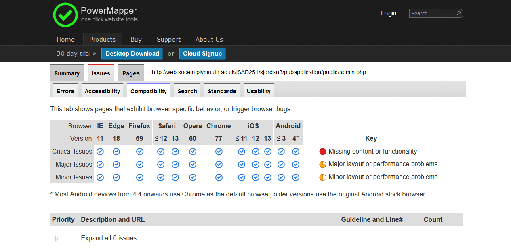

# Application Fact Sheet
# ISAD251
My repository for demonstrating ISAD251 database application development

This is the repository for demonstrating my pub application. This application is designed to let users order food and drinks and let admins change all of the details in the application. All of the requirements are able to be completed and all work as they should.

When first opening the application, you will be presented with a login screen. Here, you must login, with either a 1, as a user, or 2, as an admin. From here you are able to complete the user stories fully.

For creating an order and adding items as a user, you must first create the order, after which you are able to add items to it on the user add to order page.

## Requirements
1. As a customer I wish to order a drink/snack.
2. As a customer I wish to see what I have ordered.
3. As a customer I wish to add to my current order for a drink/snack.
4. As a customer I wish to cancel my order for a drink/snack.
5. As the admin I wish to enter details of the drinks/snacks I have for sale.
6. As the admin I wish to read the details of the drinks/snacks I have for sale.
7. As the admin I wish to view a customer’s order(s).
8. As the admin I wish to edit the details of the drinks/snacks I have for sale.
9. As the admin I wish to withdraw a drink/snack from sale.

## Images Used
I used one image, which i made myself

## Youtube Link

## Application Screenshots
### Login

### User Options

### User Add New Order

### User Add To Order

### User Cancel Orders

### User View Orders

### Admin Options

### Admin Add New Items

### Admin Edit Items
Note: Item is taken off of the customers menu if the amount is 0

### Admin View Orders

### Admin Current Items

## WAI Screenshot
Here are the results that i got from https://webaccessibility.com after i had put in the URL for the site

### Browser Compatability Test

Using PowerMapper.com i tested a couple of my pages in different browsers, getting the results below:

